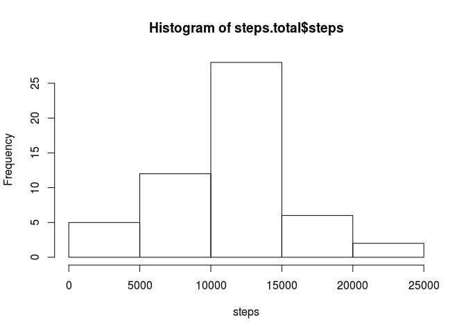
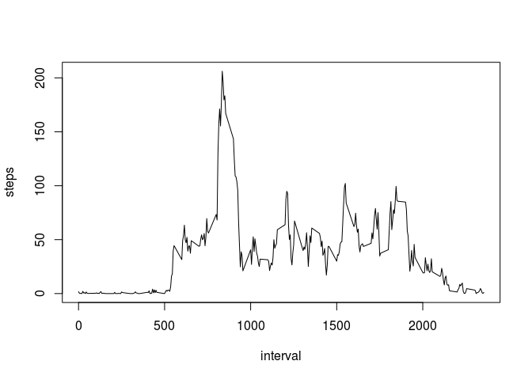
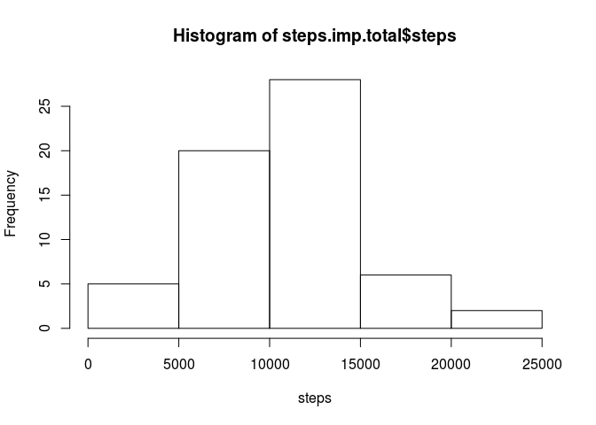
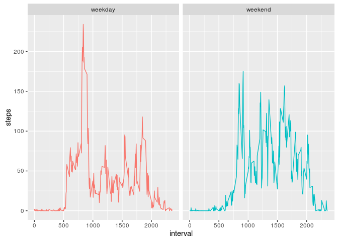

# Reproducible Research: Peer Assessment 1


## Loading and preprocessing the data

Load the dataset.


```r
unzip("activity.zip")
activity <- read.csv("activity.csv")
```


## What is mean total number of steps taken per day?

Calculate the total number of steps taken per day.


```r
steps.total <- aggregate(steps ~ date, data = activity, FUN = sum)
```

Plot a histogram of the total number of steps taken each day.


```r
hist(steps.total$steps, xlab = "steps")
```

<!-- -->

Mean and median of the total number of steps taken per day.


```r
steps.mm <- list(mean = mean(steps.total$steps), median = median(steps.total$steps))
steps.mm
```

```
## $mean
## [1] 10766.19
## 
## $median
## [1] 10765
```

* The **mean** total number of steps taken per day is **10766**.
* The **median** total number of steps taken per day is **10765**.


## What is the average daily activity pattern?

Time series plot of the 5-minute interval and the average number of steps taken, averaged across all days.


```r
steps.interval <- aggregate(steps ~ interval, data = activity, FUN = mean, na.rm = TRUE)
plot(steps ~ interval, data = steps.interval, type = "l")
```

<!-- -->

Which 5-minute interval, on average across all the days in the dataset, contains the maximum number of steps?


```r
steps.interval[which.max(steps.interval$steps), ]
```

```
##     interval    steps
## 104      835 206.1698
```

The **835th** interval.


## Imputing missing values

Calculate and report the total number of missing values in the dataset.


```r
sum(!complete.cases(activity))
```

```
## [1] 2304
```

For imputing the missing values we use the `preProcess` function of the `caret` package. The missing values will be calculated using bagged trees from the `bagImpute` method.


```r
library(caret)

activity.imp <- predict(preProcess(activity, method = "bagImpute"), activity)
```

Plot a histogram of the total number of steps taken each day in the imputed dataset.


```r
steps.imp.total <- aggregate(steps ~ date, data = activity.imp, FUN = sum)
hist(steps.imp.total$steps, xlab = "steps")
```

<!-- -->

Mean and median of the total number of steps taken per day in the imputed dataset.


```r
steps.imp.mm <- list(mean = mean(steps.imp.total$steps), median = median(steps.imp.total$steps))
steps.imp.mm
```

```
## $mean
## [1] 10515.69
## 
## $median
## [1] 10395
```

The **mean** and the **median** of steps in the new dataset are lower than in the original one. The reason is that most of the imputed values are in the *5000 - 10000* steps interval, lower than the original mean and median.


## Are there differences in activity patterns between weekdays and weekends?

Create a new factor variable in the dataset with two levels -- "weekday" and "weekend" indicating whether a given date is a weekday or weekend day.


```r
activity.days <- activity
activity.days$date <- as.Date(activity.days$date, "%Y-%m-%d")
activity.days$weekday <- weekdays(activity.days$date, abbreviate = T)

activity.days$day <- ifelse(activity.days$weekday %in% c("Sat", "Sun"), "weekend", "weekday")
activity.days$day <- as.factor(activity.days$day)
```

Check if the `day` variable is correct.


```r
table(activity.days$day, activity.days$weekday)
```

```
##          
##            Fri  Mon  Sat  Sun  Thu  Tue  Wed
##   weekday 2592 2592    0    0 2592 2592 2592
##   weekend    0    0 2304 2304    0    0    0
```

Panel containing a time series plot of the 5-minute interval (x-axis) and the average number of steps taken, averaged across all weekday days or weekend days (y-axis).


```r
library(ggplot2)

ggplot(aggregate(steps ~ interval + day, data = activity.days, FUN = mean)) +
    aes(x = interval, y = steps, color = day) +
    geom_line() +
    facet_grid(. ~ day) +
    theme(legend.position = "none")
```

<!-- -->


